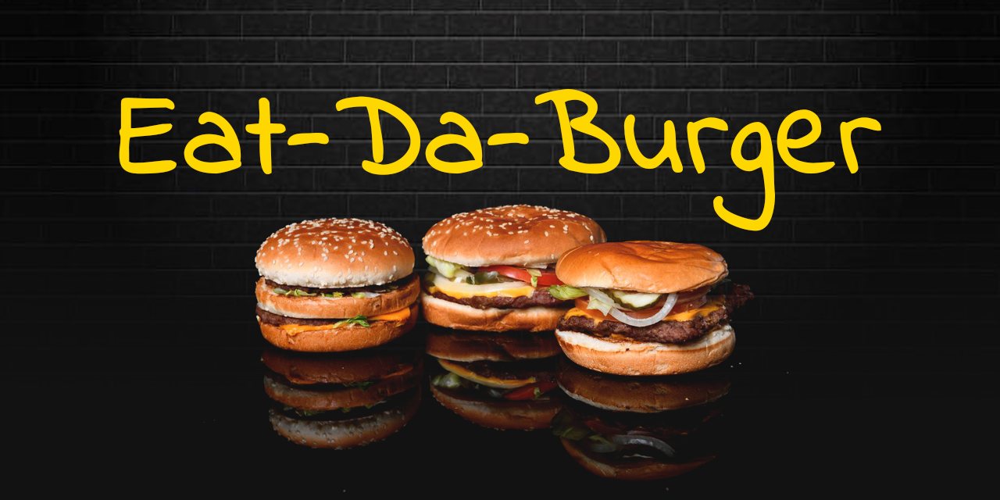

# Eat-Da-Burger! - Node Express Handlebars

### Overview

Eat-Da-Burger! is a restaurant app that lets users input the names of burgers they'd like to eat.

Whenever a user submits a burger's name, your app will display the burger on the left side of the page -- waiting to be devoured.

Each burger in the waiting area also has a Devour it! button. When the user clicks it, the burger will move to the right side of the page.

### Technologies and npm packages used

* Express
* JavaScript
* Node.js
* jQuery
* AJAX
* Bootstrap
* MySQL
* Handlebars

---

[Project demo](https://dry-harbor-65792.herokuapp.com/)

---

**Optimized for 1920x1080 screen resolution and Google Chrome Version 78**

**Optimized for 1920x1080 screen resolution and Google Chrome Version 78**

_Made for University of Arizona Coding Bootcamp, Week-14, November 2019_
